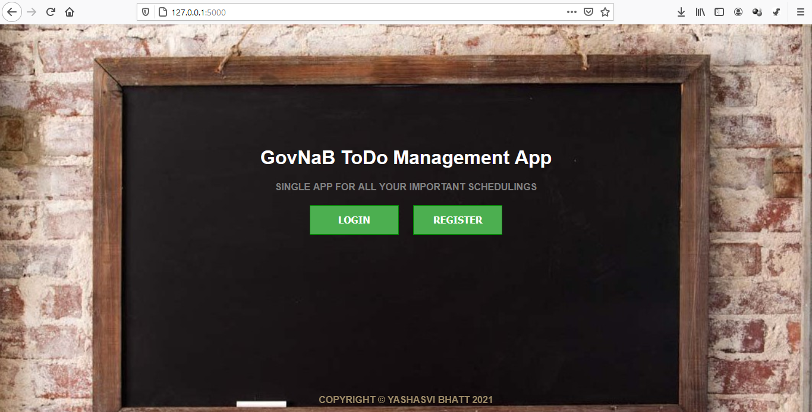
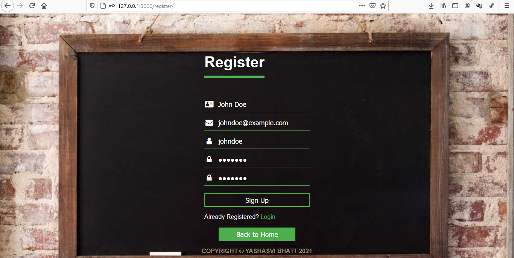
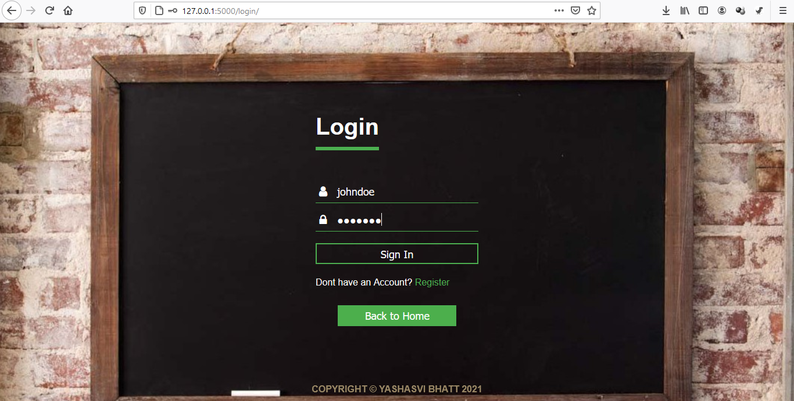
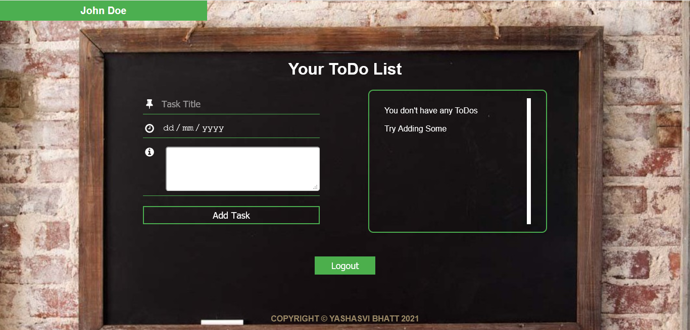
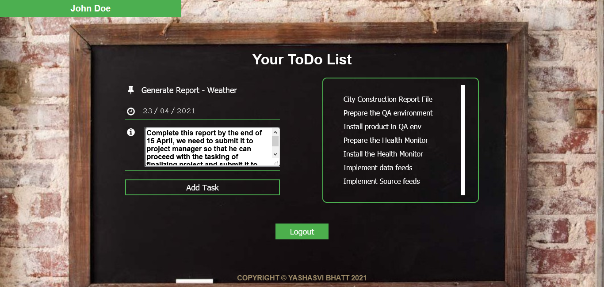
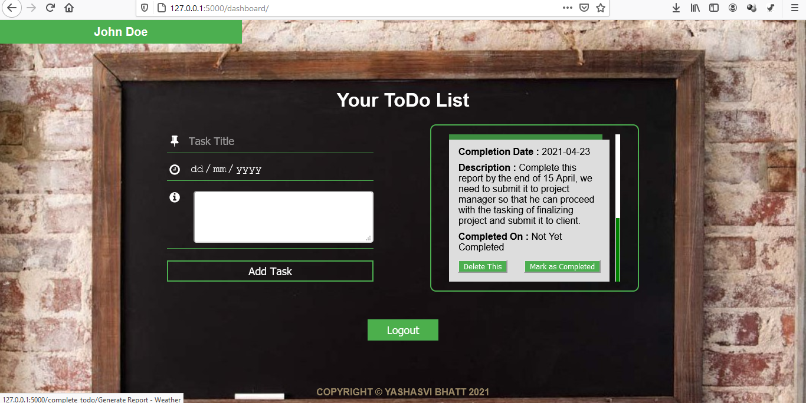
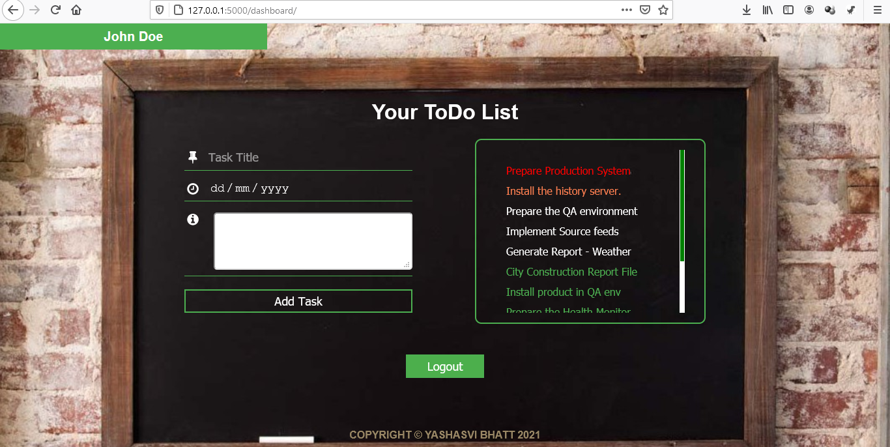

# GovNaB ToDo Management App

This app is created to help people manage their tasks. They can set the deadline so that the task giver doesn't have to wait for his/her task to be completed. This app is highly dynamic and uses the power of `Python`.

## Working

The App starts with a Home Page that asks user to `Login`, if by any chance he is not registered then he can `Register` himself from there as well.

#### Home


Then if the user doesn't have an account in the database, `Register` must be select, the user will be asked to enter details like _name_, _email_ and a unique _username_ needs to be entered. If it is taken by someone else then user will have to chose any other _username_. Once this is done then user can continue by loggin in with the same username and password that were entered while registering.

#### Register


If the user already have an account or have successfully registered, the user will be asked to enter credentials like _username_ and _password_. If they are wrong then user will have to re-enter credentials. Once this is done then user can access dashboard.

#### Login


#### Dashboard


In the dashboard page, there are 2 sections that a user can see. First section provides user the functionality to add a new task. It will ask user input for _Task Title_, _Task Completion Date_ and _Task Description_. If user give all valid inputs like _Completion Date_ greater than today and _Task_ should not exist already, then the task will be added to `Task List`.

#### Add a Task


The second section provides user the functionality to manage all the tasks. It will display all the tasks, their descriptions and completion dates. Also user can mark them complete once they think that the task has made progress to such level that it can be considered as complete. Users can also delete completed or incompleted tasks.

#### Task Details


If the date of completion and current date are same i.e user have less than a day to complete the task then that task will be displayed in orange color signifying the warning status that the deadline is reaching soon. If user have missed the deadline for a task then that task will be displayed in red color signifying a danger signal that the user have exceeded the deadline and hasn't completed the task. If a user have marked a task as completed then it will be displayed in green color signifying a success status displaying that user have completed that task completely.

#### All Tasks


The Project uses `Python-Flask` for all the dynamic rendering and webpages rendering, `MongoDB` for data collection and `Python` for logical functionality. Apart from this, webpages are designed with `HTML`, `CSS` and `JavaScript`.

This App was deployed on `Heroku`, you can access it from [here](https://www.google.com).

## Execution

- Since, the credentials used while prodution were secret and since source code is shared so original credentials were removed and thus the user will have to keep his MongoDB credentials with him.
- Please keep your mongodb credentials with you and add them to the python script.
- Generate a `secret key` with the help of `python-os` module. Open a shell and enter `python-cli` mode and type<br>>>>```import os```<br>>>>```os.urandom(16)```.<br>Copy the output and paste it in the place of `TODO` at _line 51_.
- Next, enter your collection name at `TODO` at _line 55_.
- Thirdly, generate a `MongoDB_URI` from MongoDB Official Website and paste it at _line 56_.
- Now execute the app by running `app.py` file. Please do make sure that you have installed all the _dependencies_ mentioned in `requirements.txt`.